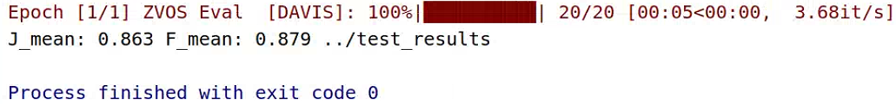

# MaskVOS


## Introduction
Video Object Segmentation (VOS) is a fundamental task in the field of computer vision, with numerous potential applications such as augmented reality and autonomous driving. Existing video object segmentation techniques can be divided into semi-supervised video object segmentation and unsupervised video object segmentation(UVOS). Supervised object segmentation requires users to provide the target mask for the first frame or key frames during the testing phase, and then segments the objects in the remaining frames. In contrast, the task of UVOS does not require any user input and typically segments the most critical and prominent objects in the video automatically. In this paper, our research focuses on UVOS.  for UVOS, the current popular framework integrates appearance and motion information through the application of feature fusion modules at multiple scales. After prolonged exploration, designing efficient multi-stage appearance-motion feature fusion methods for UVOS still requires improvement. 


 To address the aforementioned issues, we analyzed several conventional semantic segmentation methods to adapt them to the UVOS tasks. Surprisingly, the mask classification approach showed promising performance in the UVOS tasks. Inspired by Mask-former, we designed our Transformer-based UVOS framework as follows:


Compared with the existing UVOS works, our method obtains significantly superior performance with real-time inference. 


Some qualitative results of Mask Transformer, show-ing its promising prediction ability across various challenging situations are given below.


## Installation

The code requires `python>=3.8`, as well as `pytorch>=1.10` and `torchvision>=0.8`. 

## Preparation

Download datasets from [here](https://pan.baidu.com/s/1b_72ju3g4g7ItE-c89yrTQ ) (passwd: 0y0x).

Please organize the files as follows:

```
dataset/
  TrainSet/
  TestSet/
MaskVOS/
  tools/
    best.pth
    pretrained_model/
    mit_b0.pth
    swin_tiny_patch4_window7_224.pth
        pre_efficientnetv2-s.pth
        pre_efficientnetv2-m.pth
        pre_efficientnetv2-l.pth
```
## Training
```
python /tools/train.py 
```

## Inference

```
python /tools/inference.py  --infer_model_path
../tools/best.pth
--infer_dataset
DAVIS
--infer_save
../test_results/
--infer_dataset_path
../dataset/TestSet/
```

## Evaluation

```
python utils/val_uvos.py
```
We optimized the evaluation codes of UVOS tasks to enable faster evaluation:




